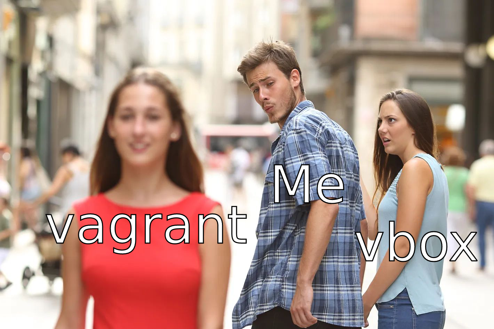

# Getting Started

### Workstation

- The trainee should have a workstation to work at
  - This can be any internet connected computer

### Some reading
- Read about the different Linux distributions

### Starting to work
- Install **VirtualBox** or **VirtManager** and **Vagrant** on the trainee's workstation
- Start a centos/7 VM
- The trainee can now get his hands dirty using this VM

