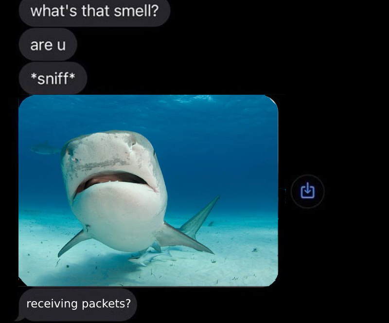

### Goals
- The trainee will learn how to work with Wireshark and `tcpdump`
- The trainee will know how to sniff packets that are sent to and from a server

### Tasks
- Wireshark
  - Download Wireshark onto your machine (Real computer, not a VM)
  - Start capturing the network traffic, try to identify packets that you recognize
  - Filter the captured packets to show HTTP and HTTPS requests only
  - Filter the captured packets to show only ICMP packets to 8.8.8.8
  - Inspect an HTTP packet and try to identify the different parts of the packet (Frame header, Packet header, TCP header, The HTTP request itself)
  - Look for a wireshark cheat sheet online and review it
- tcpdump
  - Install `tcpdump` on you machine (This time on a VM)
  - Start capturing the network traffic
  - Filter the captured packets to show HTTP and HTTPS requests only
  - Filter the captured packets to show only ICMP packets to 8.8.8.8  
  - Using `tcpdump`, save some captured packets to a ".pcap" file, then open it with Wireshark (on you machine)
  - How can you see the MAC addresses of the traffic you capture using `tcpdump`?
  - Look for a tcpdump cheat sheet online and review it

